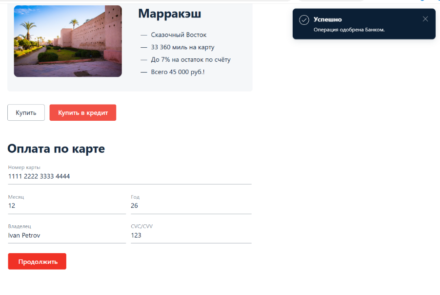
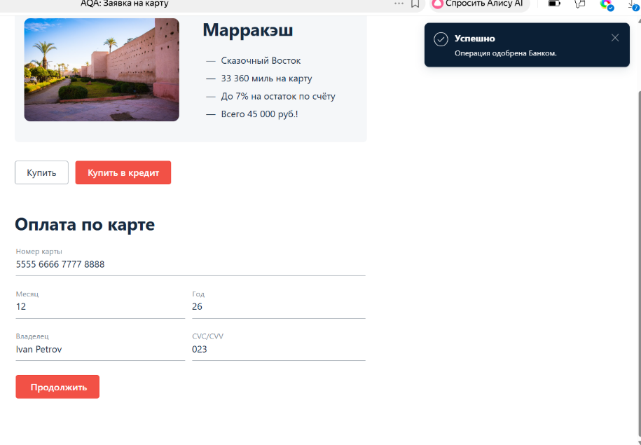
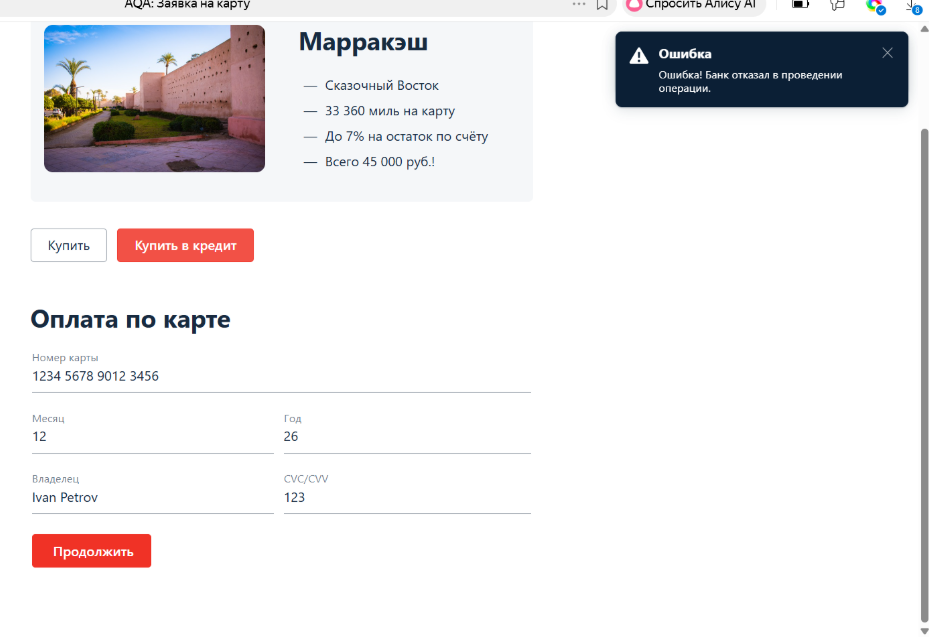
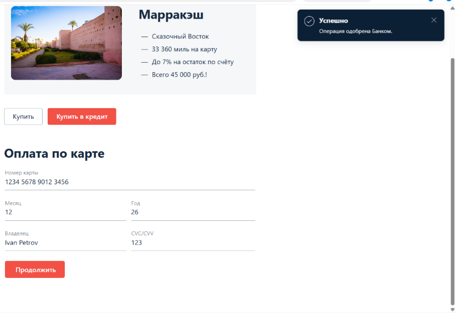
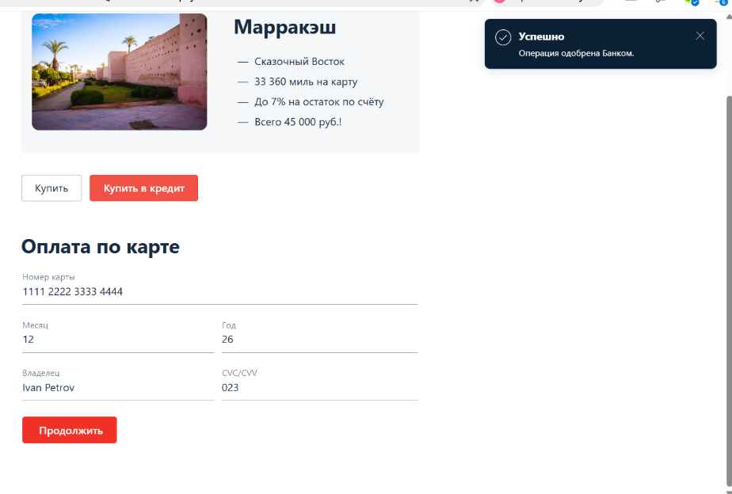
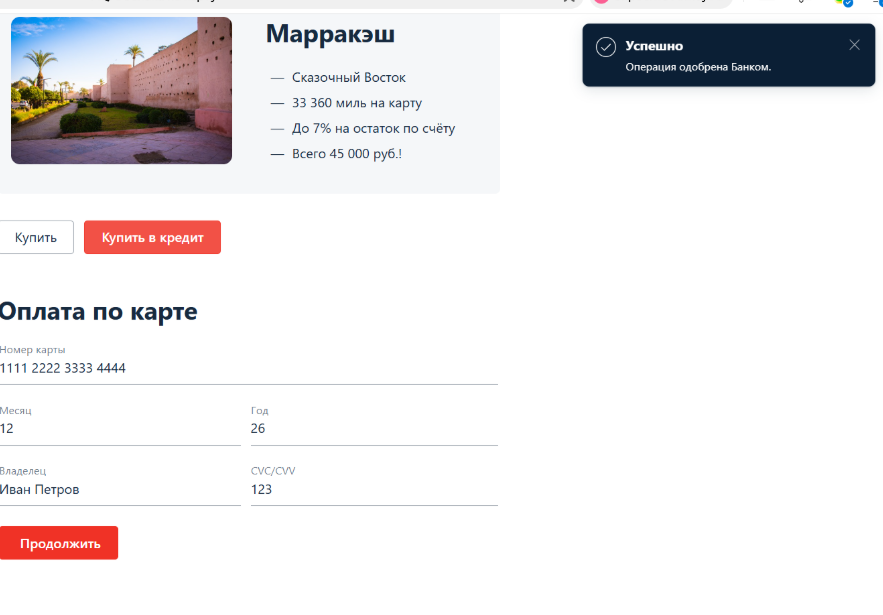
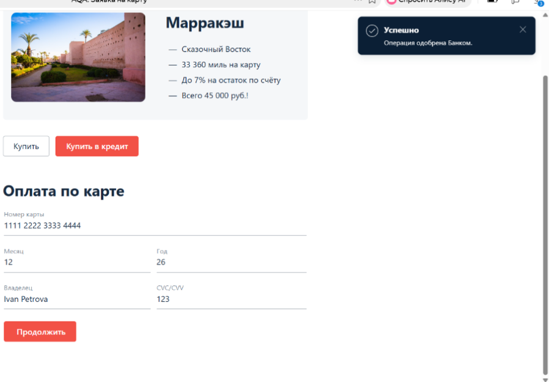
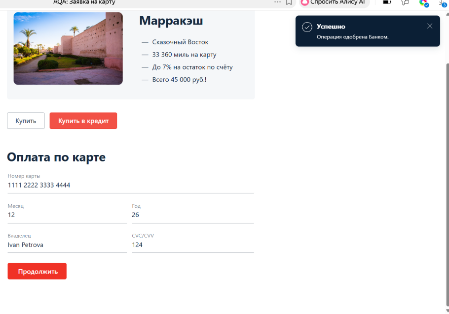
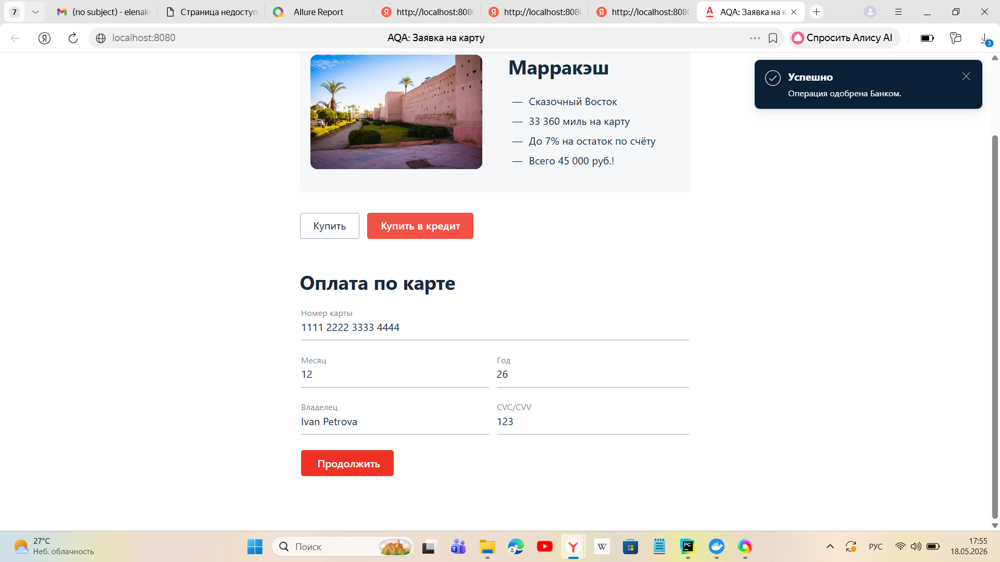

# Отчёт по итогам ручного тестирования

## Краткое описание
Проведено ручное тестирование веб-сервиса покупки туров.  
Тестировались обе формы: «Обычная оплата по дебетовой карте» и «Купить в кредит».

**Общее количество тест-кейсов:** 25  
**Найдено багов:** 9  

**Критических:** 1  
**Высоких:** 2  
**Средних:** 5

---

## Позитивный сценарий (без бага)

### Успешная оплата одобренной картой

**Скриншот:**  

**Форма:** Обычная оплата

**Что вводили:**
- Номер карты: `1111 2222 3333 4444`
- Месяц: `12`
- Год: `26`
- Владелец: `Ivan Petrov`
- CVC: `123`

**Результат:** ✅ Успешно. Операция одобрена банком.

---

## Критические баги

### Баг №1 (критический): Отклонённая карта 5555 даёт успех

**Скриншот:**  

**Форма:** Обычная оплата

**Что вводили:**
- Номер карты: `5555 6666 7777 8888`
- Месяц: `12`
- Год: `26`
- Владелец: `Ivan Petrov`
- CVC: `023`

**Фактический результат:** УСПЕШНО. ОПЕРАЦИЯ ОДОБРЕНА БАНКОМ.

**Ожидаемый результат:** Ошибка! Банк отказал

---

## Баги высокого приоритета

### Баг №2 (высокий): Карта не из набора даёт двойной ответ

**Скриншоты:**  
  

**Форма:** Обычная оплата

**Что вводили:**
- Номер карты: `1234 5678 9012 3456`
- Месяц: `12`
- Год: `26`
- Владелец: `Ivan Petrov`
- CVC: `123`

**Фактический результат:** Отказ и Успешно.

**Ожидаемый результат:** Ошибка! Банк отказал

---

### Баг №3 (высокий): CVC 023 проходит (должна быть ошибка формата)

**Скриншот:**  

**Форма:** Обычная оплата

**Что вводили:**
- Номер карты: `1111 2222 3333 4444`
- Месяц: `12`
- Год: `26`
- Владелец: `Ivan Petrov`
- CVC: `023`

**Фактический результат:** Успешно. Операция одобрена банком.

**Ожидаемый результат:** Сообщение «Неверный формат»

---

## Баги среднего приоритета

### Баг №4 (средний): Кириллица в поле «Владелец» принимается

**Скриншот:**  

**Форма:** Обычная оплата

**Что вводили:**
- Номер карты: `1111 2222 3333 4444`
- Месяц: `12`
- Год: `26`
- Владелец: `Иван Петров`
- CVC: `123`

**Фактический результат:** Успешно. Операция одобрена банком.

**Ожидаемый результат:** Сообщение «Неверный формат» (только латиница)

---

### Баг №5 (средний): Ошибка в имени владельца (Ivan Petrova) принимается

**Скриншот:**  

**Форма:** Обычная оплата

**Что вводили:**
- Номер карты: `1111 2222 3333 4444`
- Месяц: `12`
- Год: `26`
- Владелец: `Ivan Petrova`
- CVC: `123`

**Фактический результат:** УСПЕШНО. ОПЕРАЦИЯ ОДОБРЕНА БАНКОМ.

**Ожидаемый результат:** Сообщение «Неверный формат»

---

### Баг №6 (средний): CVC 124 проходит (неверный формат)

**Скриншот:**  

**Форма:** Обычная оплата

**Что вводили:**
- Номер карты: `1111 2222 3333 4444`
- Месяц: `12`
- Год: `26`
- Владелец: `Ivan Petrova`
- CVC: `124`

**Фактический результат:** УСПЕШНО. ОПЕРАЦИЯ ОДОБРЕНА БАНКОМ.

**Ожидаемый результат:** Сообщение «Неверный формат»

---

### Баг №7 (средний): Кредитная форма принимает неверные данные

**Скриншот:**  

**Форма:** Купить в кредит

**Что вводили:**
- Номер карты: `1111 2222 3333 4444`
- Месяц: `12`
- Год: `26`
- Владелец: `Ivan Petrova`
- CVC: `124`

**Фактический результат:** Успешно

**Ожидаемый результат:** Ошибка валидации

---

### Баг №9 (критический): Отсутствие записи в БД после успешной оплаты

**Форма:** Обычная оплата

**Что вводили:**
- Номер карты: 1111 2222 3333 4444
- Месяц: 12
- Год: 26
- Владелец: Ivan Petrov
- CVC: 123

**Фактический результат:**  
Сообщение «Успешно» появилось, но при проверке базы данных тест упал с ошибкой

**Ожидаемый результат:**  
В таблице `payment_entity` должна быть запись со статусом `APPROVED`

**Доказательство:** вывод автотеста при запуске `pytest tests/test_payment_positive.py -v`

## Общие рекомендации

- Отклонённая карта `5555` не должна давать успех
- Карты не из набора должны отклоняться
- Поле CVC не должно принимать ведущие нули (`023`)
- Поле «Владелец» должно принимать только латиницу без лишних символов
- Неверный формат CVC (не 123) должен давать ошибку валидации
- Кредитная форма должна валидировать данные так же строго
- **Обеспечить сохранение статуса платежа в базе данных после успешной операции**
